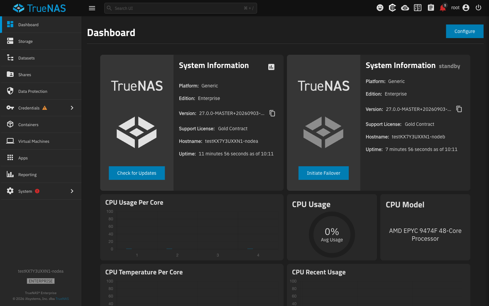
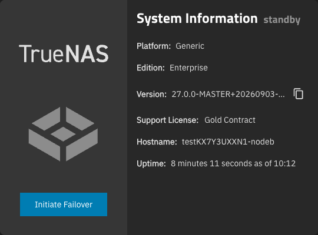
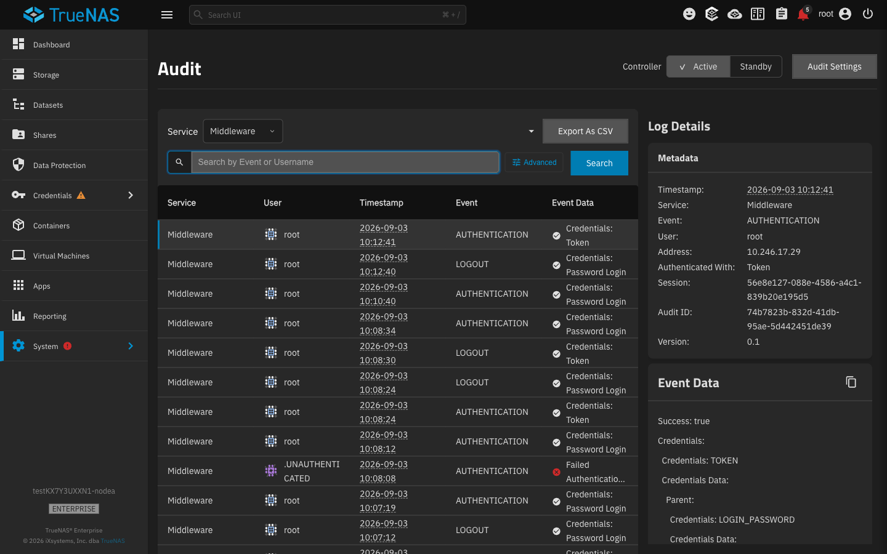
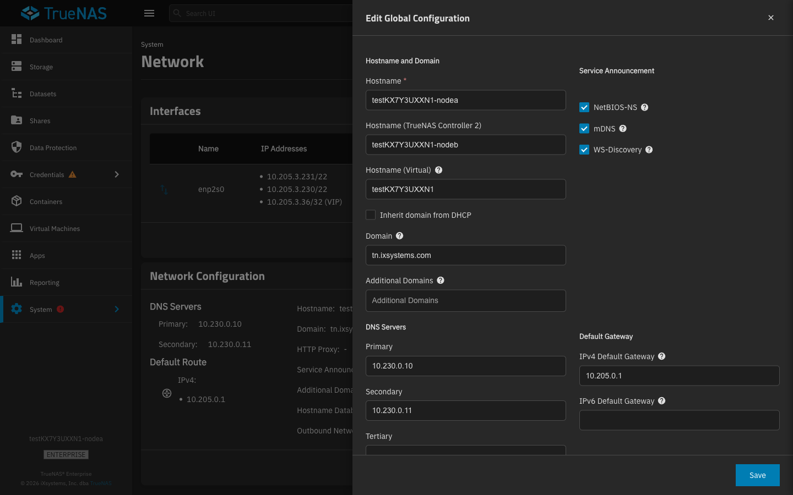
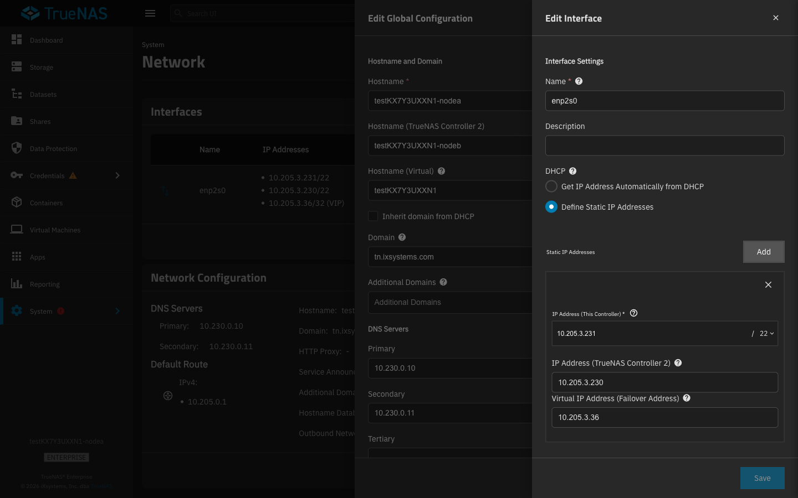
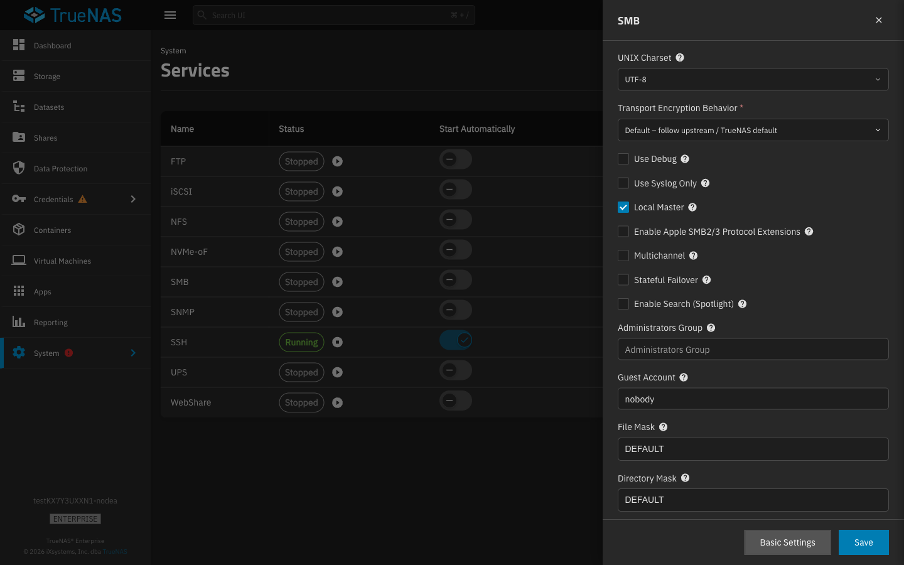
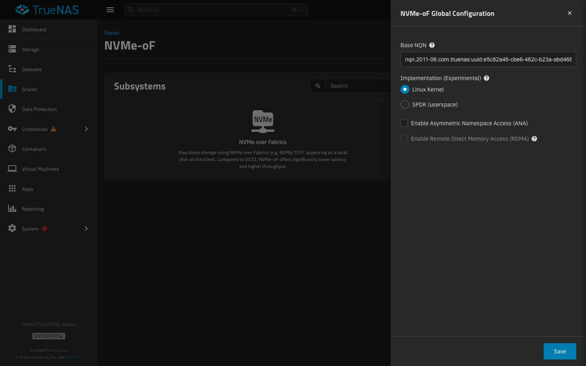
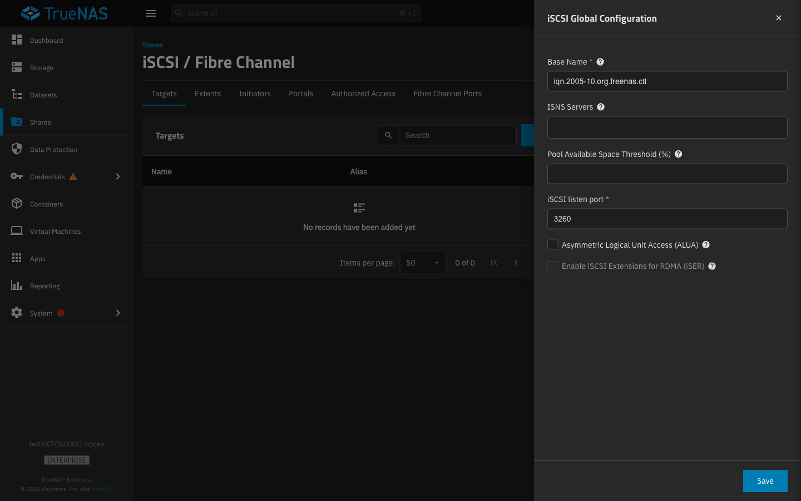
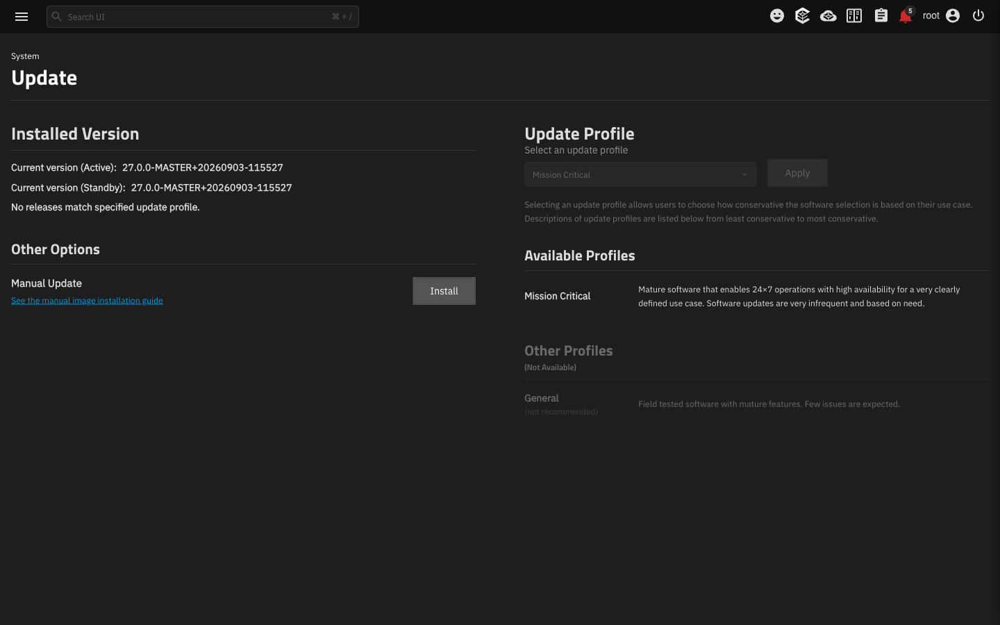
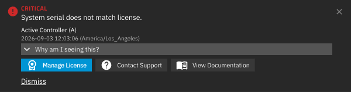

# HA gating in the webui — what, how, and what it looks like

**Ticket:** [NAS-143012](https://ixsystems.atlassian.net/browse/NAS-143012) · **Branch:** `NAS-143012` · **Captured against:** a real two-controller HA VM (`10.205.3.36`, 26.0 line), dev server on nightly UI. No mocks were used for any screenshot in §3.

Written for middleware. Everything is described in terms of the middleware calls the UI makes and the values it reads back; UI-internal state and property names are left out.

The report answers three questions, to ground the HA discussion before the remaining product-type gates are touched:

1. What HA UI content and functionality is gated today
2. How each piece is gated — endpoints and logic
3. What the content looks like

---

## 1. What is gated

Roughly thirty places in the UI change behaviour on HA. Grouped by what the user sees:

| Group | Surface | What HA changes |
|---|---|---|
| **Dashboard** | System Information (Standby) · Hostname (Standby) · Serial (Standby) · Interface IP widget · product image | Standby-controller widgets exist only on HA; the default dashboard layout includes them; the interface widget shows per-controller IPs; the standby widget carries an **Initiate Failover** action |
| **Topbar / shell** | HA status icon and popover · restart handling | Icon/popover only render on HA; a reboot on a healthy pair is treated as a failover rather than a reconnect wait |
| **Network** | Interface form controller labels, Virtual IP and Failover Group fields, IPv6-autoconfigure lock · Global Configuration `hostname_b` / `hostname_virtual` · IPMI per-controller options | Fields, labels and the lock appear only on HA |
| **Sharing / services** | SMB **Stateful Failover** · iSCSI **ALUA** · NVMe-oF **ANA** · Fibre Channel ports (per controller) | Controls exist / are enabled only on HA |
| **Audit / export** | Active / Standby controller toggle · export against the standby | Lets the user query the standby controller's data |
| **Update / reboot** | Update flow (standby version, controller-by-controller finish) · manual update form · Reboot Required dialog · restart page | Whole flows branch on HA; reboot state comes from the failover variant of the endpoint |
| **Alerts** | Controller label on every alert | Shows which node raised the alert |
| **Sign-in** | Failover validation before login | Blocks login while HA is in an inconsistent state |

---

## 2. How it is gated

### 2.1 Two calls, one answer: `failover.licensed` at sign-in, the `HA` entitlement after

`failover.licensed` and `truenas.entitlements.info[HA]` are the same decision server-side (`is_licensed_for_ha()` returns `get_entitlement(HA).entitled`). The UI reads both, at different moments:

```
sign-in (session exists, admin UI not yet started)
  failover.licensed                    → seeds "HA licensed"; callable without any role
    └─ if true: failover.status         → refuses login if HA is inconsistent

admin UI start-up, and again on every license change
  truenas.entitlements.info            → HA.entitled overrides the seed when the key is present
    └─ if HA licensed:
         failover.disabled.reasons      → fetched once…
         subscribe failover.disabled.reasons   …and kept live
```

The sign-in step stays on `failover.licensed` for one reason: `truenas.entitlements.*` require `SYSTEM_PRODUCT_READ`, and a custom privilege without that role must still be able to log in. Every built-in preset can call the entitlement API (`READONLY_ADMIN` folds in every `*_READ` role).

From those values the UI derives four conditions, and every HA surface uses one of them:

| condition | derived from |
|---|---|
| **HA licensed** | `HA.entitled` once loaded, else the `failover.licensed` seed — **the gate nearly everything uses** |
| **HA healthy** | `failover.disabled.reasons` is empty |
| **HA status** | the reasons list itself, shown in the topbar popover |
| **safe to fail over** | reasons empty, **or** every reason is one of `MISMATCH_VERSIONS`, `LOC_FIPS_REBOOT_REQ`, `REM_FIPS_REBOOT_REQ`, `LOC_GPOSSTIG_REBOOT_REQ`, `REM_GPOSSTIG_REBOOT_REQ` |

Controller identity comes from `failover.node` (`A` / `B`) and is used only for labelling.

### 2.2 Product type is out of every HA gate

Six surfaces used to evaluate HA only after `system.product_type === 'ENTERPRISE'` (topbar restart handling, alert controller labels, IPMI per-controller options, manual update form, Global Configuration hostnames, interface form). All six now read the HA condition alone, per the ticket:

> `failover.licensed` remains valid and reflects the same thing; **do not pre-gate HA UI on product type.**

The manual update form's *Restart After Update* checkbox, which additionally required `product_type === 'ENTERPRISE'`, is now offered on every non-HA system.

### 2.3 Edge behaviour

If the engine reports no `HA` key at all (a middleware without the entitlement engine), the sign-in seed stands and nothing is overridden. A denied `HA` entitlement after sign-in wins over a `true` seed, so a license change takes effect without re-login. No HA surface reads the entitlement directly; all of them read the one store value described above, so a missing key can never fail open into HA.

---

## 3. What it looks like

All captures at 1440×900, real data from the HA VM. Under each image: the condition that decides whether it renders, and the endpoints that feed it.

### Dashboard — standby controller widget and HA icon


**Condition:** `failover.licensed` — also selects the HA default dashboard layout
**Endpoints:** `failover.licensed` · `webui.main.dashboard.sys_info` → `remote_info` (the standby controller's info)

The **System Information (Standby)** widget only exists on HA:



**Endpoints:** `webui.main.dashboard.sys_info` → `remote_info.{hostname, version, uptime_seconds, system_serial, license}`

It also carries an HA-only **action** — the **Initiate Failover** button, enabled on the *safe to fail over* condition above, which calls `failover.become_passive`.

### Topbar — HA status icon
The right-hand icon cluster; the HA icon is the stacked-controllers glyph, first in the cluster (left of the feedback face):


Close-up (the "enabled" state; "disabled" and "reconnecting" are the other two):


**Condition:** `failover.licensed`
**Endpoints:** `failover.disabled.reasons` (call + live subscription). Icon state: reasons empty → *enabled*; first reason `NO_SYSTEM_READY` → *reconnecting*; anything else → *disabled*. Clicking opens a popover listing the reasons.

### Audit — Active / Standby controller toggle


**Condition:** `failover.licensed`
**Endpoints:** `audit.query` with `remote_controller: true` when Standby is selected; `audit.export` takes the same parameter

### Network — Global Configuration HA hostnames
`Hostname (TrueNAS Controller 2)` and `Hostname (Virtual)`:



**Condition:** `failover.licensed` alone (fixed on this branch; previously also required `product_type === ENTERPRISE`)
**Endpoints:** `network.configuration.config` → `hostname_b`, `hostname_virtual` — keys are **absent**, not `null`, on non-HA · `network.configuration.update`

### Network — Interface form controller labels and failover fields
Both HA panels happen to be stacked in this frame: Global Configuration behind, the interface edit in front. Visible: **IP Address (This Controller)**, **IP Address (TrueNAS Controller 2)**, **Virtual IP Address (Failover Address)**. The **Failover Group** field and the IPv6-autoconfigure lock are further down the same panel.



**Condition:** `failover.licensed` for the Virtual IP / Failover Group fields and the IPv6-autoconfigure lock; label suffixes from `failover.node` (`A` → "This Controller" / "TrueNAS Controller 2"; `B` → reversed)
**Endpoints:** `failover.licensed` · `failover.node` · `interface.update` / `interface.create` with `failover_aliases`, `failover_virtual_aliases`, `failover_group`

### SMB service — Stateful Failover
Panel scrolled to the Advanced section. **Enable Search (Spotlight)** directly beneath it is the `TRUESEARCH` entitlement gate, unrelated to HA.



**Condition:** `failover.licensed`, and no share with an incompatible purpose (`sharing.smb.query`), and SMB1 not enabled (`smb.config`)
**Endpoints:** `smb.config` / `smb.update` → `stateful_failover`

### NVMe-oF Global Configuration — ANA


**Condition:** `failover.licensed` (control disabled otherwise). The **Implementation** radio above it is the `NVMEOF_SPDK` entitlement; **RDMA** beneath it is greyed by `rdma.capable_protocols` (no RDMA NIC on this VM) — neither is HA.
**Endpoints:** `nvmet.global.update` → `ana`

### iSCSI Global Target Configuration — ALUA


**Condition:** `failover.licensed` (control disabled otherwise). **iSER** beneath it is greyed by `rdma.capable_protocols`; the **Fibre Channel Ports** tab behind the panel is the `FIBRECHANNEL` entitlement — neither is HA.
**Endpoints:** `iscsi.global.update` → `alua`

### Update — Active and Standby versions


_(The alerts side panel is open in this frame; it is not part of the update UI.)_

**Condition:** `failover.licensed` — shows the standby version and switches the update flow to controller-by-controller completion
**Endpoints:** `webui.main.dashboard.sys_info` → `remote_info.version` · `update.status`, `update.profile_choices`, `update.config` · on HA the run is the `failover.upgrade` job instead of `update.run`

### Alerts — controller label on every alert


**Condition:** `failover.licensed` — renders the alert's `node`
**Endpoints:** `alert.list` → `node` (the alerts shown are themselves about the pair: serial mismatch on the active and standby nodes)

### Not captured
- **IPMI controller options** — this VM has no BMC, so the IPMI card does not render. Condition: `product_type === ENTERPRISE` → `failover.licensed` → `failover.node` (one of the four pre-gates in §2.2). Endpoints: `failover.node`, `ipmi.lan.query`.
- **Reboot Required dialog** — only appears with a pending reboot. On HA it reads `failover.reboot.info` (call + subscription) instead of `system.reboot.info`, labels the two nodes "Active Controller" / "Standby Controller", and — when *safe to fail over* is false — shows a failover warning listing `failover.disabled.reasons`.
- **Restart page** — on a licensed *and* healthy pair, the UI stops trying to reconnect during the reboot because a failover is expected. Endpoint: `system.reboot` job.
- **Sign-in failover validation** — `failover.licensed` → `failover.status` must be `MASTER` or `SINGLE` → `failover.disabled.reasons`; anything else blocks login as "HA is in an inconsistent state".
